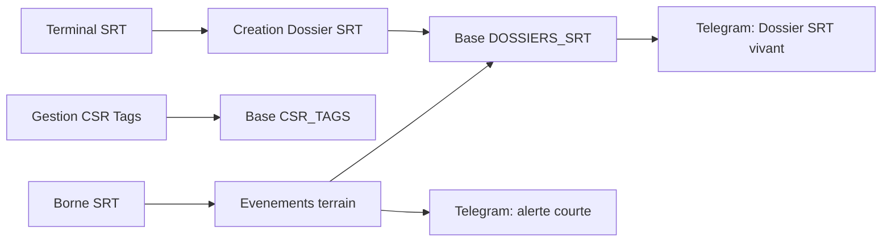

# SRT - Spot Repair Tracking

## Version pilote terrain

Objectif : obtenir une V1 simple, elegante, robuste et immediatement testable sur un parc reel avec 5 a 20 CSR Tags, extensible ensuite a 50 CSR Tags sans intervention technique complexe.

> Note d'analyse : les fichiers sources `simulateur Telegram V8` et `borne_srt_v1_esp32_ble_telegram.ino` n'etaient pas presents dans l'espace de travail fourni. L'application publiee a ete demandee en analyse, mais la recuperation reseau locale a echoue. Ce document fixe donc l'architecture cible et les contrats d'integration a appliquer au systeme existant, en preservant au maximum les workflows deja valides.

---

## 1. Principes produit

Le SRT ne planifie pas.  
Le SRT ne donne pas d'ordres.  
Le SRT facilite la communication terrain.

Le produit doit :

- creer de la visibilite sur les vehicules signales ;
- reduire les oublis ;
- encourager la cooperation entre comptoir, parc, reception, responsable et reparateur ;
- conserver une trace lisible sans transformer l'outil en ERP ;
- rester utilisable en plein soleil, sur smartphone Android, avec le moins de clics possible.

### Vocabulaire officiel

Afficher dans l'interface :

- CSR Tag
- Borne SRT
- Dossier SRT
- Terminal SRT
- Dossiers en cours...

Ne jamais afficher a l'utilisateur :

- Beacon
- BLE
- RSSI
- MAC Address
- jargon technique

Ces informations restent reservees aux logs et a la configuration interne.

---

## 2. Architecture cible

### Composants

1. **Terminal SRT**
   - Smartphone Android.
   - Sert a creer un Dossier SRT.
   - Capture la photo de signalement.
   - Saisit la plaque.
   - Scanne le QR Code du CSR Tag.
   - Consulte les Dossiers en cours...
   - Ajoute, si besoin, le retour prevu et la photo finale.

2. **Gestion CSR Tags**
   - Section dediee dans le Terminal SRT.
   - Permet a Remi d'ajouter un CSR Tag sans modifier le code.
   - Genere automatiquement le nom CSR-06, CSR-07, CSR-08...
   - Genere automatiquement le QR Code.
   - Rend le CSR Tag utilisable immediatement.

3. **Borne SRT**
   - ESP32 DevKit.
   - Detecte les CSR Tags connus.
   - Envoie les evenements utiles au systeme.
   - Ne contient pas de liste figée de CSR Tags.

4. **Telegram**
   - Canal de visibilite terrain.
   - Recoit les Dossiers SRT vivants.
   - Recoit les alertes courtes.
   - Le message principal du Dossier SRT est mis a jour au lieu d'etre recree a chaque mouvement.

5. **Base SRT**
   - Stockage simple et robuste.
   - Peut commencer en local ou via un backend leger.
   - Doit etre structuree pour migrer ensuite vers Supabase, Firebase, SQLite serveur ou autre stockage durable.

### Flux general



---

## 3. Structure base de donnees

### Table `CSR_TAGS`

| Champ | Type | Regle |
|---|---|---|
| `id` | UUID ou entier | Identifiant interne |
| `nom_csr` | texte unique | Exemple : CSR-01 |
| `mac_ble` | texte unique | Stockee mais jamais affichee au public |
| `qr_payload` | texte unique | Exemple : `SRT:CSR:CSR-01` |
| `qr_code_data_url` | texte optionnel | Image QR generee |
| `statut` | texte | `disponible`, `attribue`, `retire` |
| `date_creation` | datetime | Creation du CSR Tag |
| `date_modification` | datetime | Derniere modification |

### Table `DOSSIERS_SRT`

| Champ | Type | Regle |
|---|---|---|
| `id` | UUID ou entier | Identifiant interne |
| `plaque` | texte | Saisie libre normalisee en majuscules |
| `csr_tag_id` | reference | CSR Tag associe |
| `photo_signalement` | URL ou fichier | Obligatoire en creation terrain |
| `statut` | texte | `signale`, `mouvement_detecte`, `retour_detecte`, `sortie_detectee`, `termine` |
| `photo_finale` | URL ou fichier | Recommandee, jamais obligatoire |
| `date_creation` | datetime | Creation du dossier |
| `date_cloture` | datetime optionnel | Cloture |
| `telegram_message_id` | texte | Message principal du dossier |
| `dernier_evenement` | texte | Dernier evenement lisible |
| `date_dernier_evenement` | datetime | Pour suivi et futurs rappels |

### Table recommandee `EVENEMENTS_SRT`

Cette table n'est pas dans le minimum demande, mais elle rend le systeme beaucoup plus robuste.

| Champ | Type | Regle |
|---|---|---|
| `id` | UUID ou entier | Identifiant interne |
| `dossier_id` | reference | Dossier concerne |
| `type_evenement` | texte | `creation`, `retour_detecte`, `mouvement_detecte`, `sortie_detectee`, `photo_finale`, `cloture` |
| `source` | texte | `terminal`, `borne_srt`, `telegram` |
| `message` | texte | Resume lisible |
| `date_creation` | datetime | Horodatage |
| `donnees_log` | JSON optionnel | Donnees techniques reservees aux logs |

---

## 4. Gestion CSR Tags

### Ecran dedie

Nom de section : **Gestion CSR Tags**

Contenu :

- liste des CSR Tags ;
- statut visible : disponible, attribue, retire ;
- bouton principal : **Ajouter CSR Tag** ;
- action QR : afficher, telecharger, imprimer ;
- recherche simple par nom CSR.

### Ajout rapide d'un CSR Tag

Workflow obligatoire :

1. Ouvrir **Gestion CSR Tags**.
2. Cliquer **Ajouter CSR Tag**.
3. Scanner ou saisir la valeur technique du CSR Tag.
4. Le systeme verifie qu'elle n'existe pas deja.
5. Le systeme attribue automatiquement le prochain nom libre : CSR-06, CSR-07...
6. Le systeme genere le QR Code.
7. Cliquer **Sauvegarder**.
8. Le CSR Tag devient immediatement disponible.

### Regles de nommage

- Format : `CSR-XX`.
- De 1 a 9 : `CSR-01` a `CSR-09`.
- A partir de 10 : `CSR-10`, `CSR-11`, etc.
- Le prochain numero est le plus petit numero libre.
- Un CSR Tag retire ne doit pas etre reutilise automatiquement sans confirmation.

### Format QR Code

Format recommande :

```text
SRT:CSR:CSR-01
```

Pourquoi ce format :

- il ne montre pas la valeur technique ;
- il est lisible ;
- il permet au Terminal SRT de retrouver le CSR Tag dans la base ;
- il reste stable meme si des informations internes changent plus tard.

Quand un QR Code est scanne :

1. le Terminal lit `SRT:CSR:CSR-01` ;
2. il cherche `CSR-01` dans `CSR_TAGS` ;
3. il recupere la valeur technique associee en interne ;
4. l'utilisateur voit uniquement `CSR-01`.

---

## 5. Creation Dossier SRT

Workflow obligatoire :

```text
Photo + Plaque + Scan QR Code CSR Tag = Creation Dossier SRT
```

Ne pas demander :

- type impact ;
- aile ;
- porte ;
- pare-chocs ;
- commentaire obligatoire.

La photo porte l'information. Le Terminal SRT doit donc privilegier :

- appareil photo ouvert rapidement ;
- saisie plaque visible et large ;
- scan QR Code immediat ;
- bouton de creation clair.

### Regles metier

- Un CSR Tag disponible peut etre attribue a un seul Dossier SRT actif.
- Un Dossier SRT actif bloque le CSR Tag jusqu'a cloture.
- Si un utilisateur scanne un CSR Tag deja attribue, afficher le Dossier SRT en cours.
- La plaque doit etre normalisee en majuscules, sans bloquer les formats atypiques.

---

## 6. Dossier SRT vivant dans Telegram

### Message principal

Un Dossier SRT correspond a un message principal Telegram.

Exemple :

```text
🚗 VEHICULE SIGNALE
AA-984-55

🏷️ CSR Tag : CSR-03
📍 Statut : signale
🕒 Dernier evenement : creation
📅 Retour prevu : non renseigne
📷 Photo finale : non ajoutee
```

Chaque evenement important met a jour ce message principal via `editMessageText` ou equivalent.

### Alertes courtes

La Borne SRT genere seulement des alertes courtes :

```text
🟢 RETOUR DETECTE - CSR-03 - AA-984-55
```

```text
🟠 MOUVEMENT DETECTE - CSR-03 - AA-984-55
```

```text
🔴 SORTIE DETECTEE - CSR-03 - AA-984-55
```

Les alertes ne doivent jamais recreer une fiche complete.

### Cloture

Message final :

```text
✅ Intervention terminee
🏷️ CSR Tag disponible pour un nouveau dossier.
```

Ajouter une seule phrase aleatoire, uniquement a la cloture :

- Se grenn diri ka fe sak diri.
- Petits degats. Grandes differences.
- Quelques minutes aujourd'hui. Beaucoup moins demain.

---

## 7. Integration Borne SRT

### Principe essentiel

La Borne SRT ne doit plus porter une liste compilee de CSR Tags.

Elle doit recevoir ou recuperer la liste des CSR Tags actifs depuis une source configurable :

1. fichier JSON heberge ;
2. endpoint API simple ;
3. synchronisation locale via le Terminal SRT ;
4. stockage NVS de l'ESP32 mis a jour sans recompilation.

Pour une V1 rapide, l'option recommandee est :

```text
Borne SRT -> endpoint /csr-tags/actifs -> liste technique autorisee
```

### Contrat de configuration

La Borne SRT consomme une liste interne :

```json
[
  {
    "nom_csr": "CSR-01",
    "mac_ble": "F0:B1:DA:66:E2:A3",
    "statut": "disponible"
  }
]
```

Cette liste ne doit pas etre exposee dans l'interface utilisateur.

### Contrat evenement

Quand la Borne SRT detecte un evenement, elle envoie :

```json
{
  "nom_csr": "CSR-03",
  "type_evenement": "retour_detecte",
  "date_evenement": "2026-06-10T21:30:00-04:00",
  "borne": "Borne SRT 1"
}
```

Le serveur ou simulateur :

1. retrouve le Dossier SRT actif lie a `CSR-03` ;
2. ajoute une ligne `EVENEMENTS_SRT` ;
3. met a jour `DOSSIERS_SRT.statut` ;
4. met a jour le message Telegram principal ;
5. envoie l'alerte courte.

### Anti-bruit terrain

Pour eviter trop d'alertes :

- ignorer les repetitions identiques pendant une courte fenetre ;
- conserver le dernier etat connu par CSR Tag ;
- ne declencher une sortie qu'apres une absence confirmee ;
- ne declencher un retour qu'apres une presence stable.

Les seuils restent techniques et invisibles dans l'interface.

---

## 8. Integration QR Codes

### Generation

Le QR Code est genere a la creation du CSR Tag.

Fonctions attendues :

- affichage du QR Code ;
- telechargement PNG ;
- impression simple ;
- regeneration visuelle si besoin, sans changer le payload.

### Impression terrain

Page d'impression recommandee :

- nom visible tres grand : `CSR-03` ;
- QR Code centre ;
- mention courte : `CSR Tag SRT` ;
- aucune valeur technique visible.

---

## 9. Interface et design

### Direction visuelle

S'inspirer fortement du CSR StockBot :

- fond sombre ;
- noir, violet, blanc ;
- cartes lisibles ;
- gros boutons ;
- contraste eleve ;
- excellente lisibilite au soleil.

### Navigation minimale

Sections recommandees :

1. **Dossiers en cours...**
2. **Nouveau Dossier SRT**
3. **Gestion CSR Tags**
4. **Historique**
5. **Parametres**

### Ecran d'accueil

L'ecran principal doit montrer immediatement :

- Dossiers en cours...
- statut de chaque Dossier SRT ;
- CSR Tag associe ;
- plaque ;
- dernier evenement ;
- action rapide : ouvrir le dossier.

Eviter une page marketing ou explicative. L'utilisateur doit pouvoir agir tout de suite.

---

## 10. API minimale V1

Cette API peut etre simulee au debut, puis remplacee par un backend reel.

### CSR Tags

```http
GET /api/csr-tags
POST /api/csr-tags
GET /api/csr-tags/actifs
GET /api/csr-tags/:nom
PATCH /api/csr-tags/:nom
```

### Dossiers SRT

```http
GET /api/dossiers?statut=actif
POST /api/dossiers
GET /api/dossiers/:id
PATCH /api/dossiers/:id/retour-prevu
POST /api/dossiers/:id/photo-finale
POST /api/dossiers/:id/cloture
```

### Evenements Borne SRT

```http
POST /api/evenements/borne-srt
```

---

## 11. Plan de deploiement pilote

### Phase 1 - Stabilisation V1

Objectif : tester le workflow complet avec 5 CSR Tags.

Actions :

- integrer la base `CSR_TAGS` ;
- ajouter la section **Gestion CSR Tags** ;
- generer les QR Codes ;
- creer le workflow `Photo + Plaque + Scan QR` ;
- connecter Telegram en mode Dossier SRT vivant ;
- conserver les logs techniques hors interface.

### Phase 2 - Terrain limite

Objectif : utiliser le SRT sur un petit volume reel.

Actions :

- imprimer CSR-01 a CSR-05 ;
- poser les CSR Tags ;
- former 1 a 2 utilisateurs ;
- valider la creation d'un Dossier SRT en moins de 30 secondes ;
- tester retour prevu ;
- tester photo finale ;
- tester cloture et liberation du CSR Tag.

### Phase 3 - Borne SRT

Objectif : connecter les evenements automatiques.

Actions :

- brancher la Borne SRT ;
- verifier la recuperation des CSR Tags actifs ;
- envoyer les evenements vers `/api/evenements/borne-srt` ;
- regler l'anti-bruit terrain ;
- valider les alertes courtes Telegram.

### Phase 4 - Extension 20 CSR Tags

Objectif : prouver que Remi peut ajouter des CSR Tags sans intervention technique.

Actions :

- ajouter CSR-06 a CSR-20 depuis **Gestion CSR Tags** ;
- generer et imprimer les QR Codes ;
- verifier que la Borne SRT recupere la nouvelle liste ;
- verifier qu'aucune recompilation ESP32 n'est necessaire.

---

## 12. Definition de fini V1

La V1 est prete pour pilote terrain lorsque :

- un CSR Tag peut etre ajoute en moins de 30 secondes ;
- le QR Code est genere automatiquement ;
- un Dossier SRT peut etre cree avec photo, plaque et scan QR ;
- Telegram recoit un message principal vivant ;
- la Borne SRT peut declencher retour, mouvement et sortie ;
- les alertes Telegram restent courtes ;
- un CSR Tag est libere a la cloture ;
- aucun jargon technique n'apparait dans l'interface ;
- le systeme fonctionne avec au moins 20 CSR Tags ;
- le design reste sombre, lisible, moderne et proche de CSR StockBot.

---

## 13. Priorites d'implementation

Ordre recommande :

1. Ajouter le modele `CSR_TAGS`.
2. Ajouter **Gestion CSR Tags**.
3. Ajouter generation QR Code.
4. Modifier la creation Dossier SRT pour imposer photo + plaque + scan QR.
5. Ajouter l'etat `csr_tag.disponible / attribue`.
6. Ajouter message Telegram principal editable.
7. Ajouter endpoint evenements Borne SRT.
8. Connecter la Borne SRT a une liste dynamique de CSR Tags.
9. Ajouter impression QR Codes.
10. Tester avec CSR-01 a CSR-05, puis CSR-06 a CSR-20.
